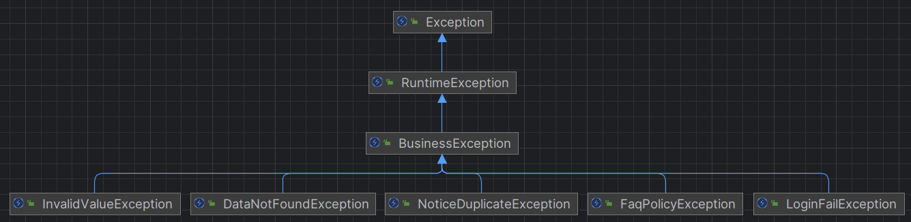

# `Exception Guide`

## 1) 예외 전략
### 비즈니스 예외를 위한 최상위 예외클래스: BusinessException
- demo-admin 애플리케이션의 비즈니스 예외를 위한 최상위 클래스를 BusinessException 으로 정의합니다.
- 그리고 각 도메인별 발생할 수 있는 공통적인 성격의 예외(InvalidValueException, DataNotFoundException, ..)를 global 패키지 내부에 정의하고, 각 도메인별 예외 클래스가 해당 예외 클래스를 상속받도록 정의합니다.
- 따라서, 각 도메인별 모든 예외 클래스는 global 패키지에 정의된 예외를 상속받으며, global 패키지에 정의한 예외 클래스는 모두 BusinessException을 상속받습니다.

  - InvalidValueException : 유효하지 않은 값의 경우 예외를 던지는 Exception (ex. 해당 도메인 정책에 맞지 않는 값이 서버로 인입된 경우, 이미 중복된 값이 있어 더이상의 로직을 처리할 수 없는 경우 등)
  - DataNotFoundException : 데이터를 찾지 못했을 경우 예외를 던지는 Exception (ex. DB에서 데이터가 존재해야 이후 처리를 진행할 수 있지만, 데이터가 없는 경우 등)
  - UploadFileException : 파일 업로드 처리 과정에서 유효하지 않거나 오류 발생시 예외를 던지는 Exception 
  - (고민)
    - 범용/추상적 개념의 예외클래스와 도메인별 예외 클래스를 어느 정도의 범위까지 정의할 것인가.


## 2) 예외 처리
### API 예외 처리를 위한 클래스: GlobalExceptionHandler(@RestControllerAdvice)
- API 예외의 경우 ApiExceptionHandler(@RestControllerAdvice)에서 공통으로 응답 처리한다.
```java
@Slf4j
@RestControllerAdvice(annotations = RestController.class)
public class ApiExceptionHandler {

  @ExceptionHandler(MethodArgumentNotValidException.class)
  protected ResponseEntity<ErrorResponse> handleMethodArgumentNotValidException(MethodArgumentNotValidException e) {
    log.error("handleMethodArgumentNotValidException", e);
    final ErrorResponse response = ErrorResponse.of(HttpStatus.BAD_REQUEST.value(), e.getBindingResult());
    return new ResponseEntity<>(response, HttpStatus.BAD_REQUEST);
  }

  @ExceptionHandler(MethodArgumentTypeMismatchException.class)
  protected ResponseEntity<ErrorResponse> handleMethodArgumentTypeMismatchException(MethodArgumentTypeMismatchException e) {
    log.error("handleMethodArgumentTypeMismatchException", e);
    final ErrorResponse response = ErrorResponse.of(HttpStatus.BAD_REQUEST.value());
    return new ResponseEntity<>(response, HttpStatus.BAD_REQUEST);
  }

  @ExceptionHandler(BindException.class)
  protected ResponseEntity<ErrorResponse> handleBindException(BindException e) {
    log.error("handleBindException", e);
    final ErrorResponse response = ErrorResponse.of(HttpStatus.BAD_REQUEST.value(), e.getBindingResult());
    return new ResponseEntity<>(response, HttpStatus.BAD_REQUEST);
  }

  @ExceptionHandler(HttpRequestMethodNotSupportedException.class)
  protected ResponseEntity<ErrorResponse> handleHttpRequestMethodNotSupportedException(HttpRequestMethodNotSupportedException e) {
    log.error("handleHttpRequestMethodNotSupportedException", e);
    final ErrorResponse response = ErrorResponse.of(HttpStatus.METHOD_NOT_ALLOWED.value());
    return new ResponseEntity<>(response, HttpStatus.METHOD_NOT_ALLOWED);
  }

  @ExceptionHandler(BusinessException.class)
  protected ResponseEntity<ErrorResponse> handleBusinessException(BusinessException e) {
    log.error("handleBusinessException", e);
    final ErrorResponse response = ErrorResponse.of(HttpStatus.BAD_REQUEST.value(), e.getMessage());
    return new ResponseEntity<>(response, HttpStatus.BAD_REQUEST);
  }

  @ExceptionHandler(Exception.class)
  protected ResponseEntity<ErrorResponse> handleException(Exception e) {
    log.error("handleException", e);
    // 개발자 알람 전송
    final ErrorResponse response = ErrorResponse.of(HttpStatus.INTERNAL_SERVER_ERROR.value());
    return new ResponseEntity<>(response, HttpStatus.INTERNAL_SERVER_ERROR);
  }
}
```

### HTML 화면 제공 처리 과정에서의 예외 처리를 위한 클래스: ViewExceptionHandler(@ControllerAdvice)
- HTML 화면 제공 처리 과정에서의 예외는 ViewExceptionHandler(@ControllerAdvice)에서 응답 처리한다.
- 단, ViewExceptionHandler 에서 다루지 않는 예외의 경우는 스프링 부트 기본 오류 처리 매커니즘(BasicErrorController)를 따른다.
```java
@Slf4j
@ControllerAdvice(annotations = Controller.class)
public class ViewExceptionHandler {

    @ExceptionHandler(BusinessException.class)
    protected ModelAndView handleBusinessException(BusinessException e) {
        log.info("handleBusinessException", e);
        return errorHtml(e.getMessage());
    }

    private ModelAndView errorHtml(String msg) {
        ModelAndView mav = new ModelAndView();
        mav.addObject("msg", msg);
        mav.addObject("url", "/");
        mav.setViewName("/common/redirect");
        return mav;
    }
}
```
- (참고) ViewExceptionHandler 에서는 내부 비즈니스 예외 발생의 경우(BusinessException)에 한해서 정상적으로 응답 처리되도록 한다. 응답 처리 과정은 다음과 같다.
  - 응답 처리: 내부 redirct 페이지로 이동하여 예외 메시지를 alert 출력한 후, 메인 페이지로 이동한다.

### API 공통 응답 포맷: ErrorResponse
- 작성중