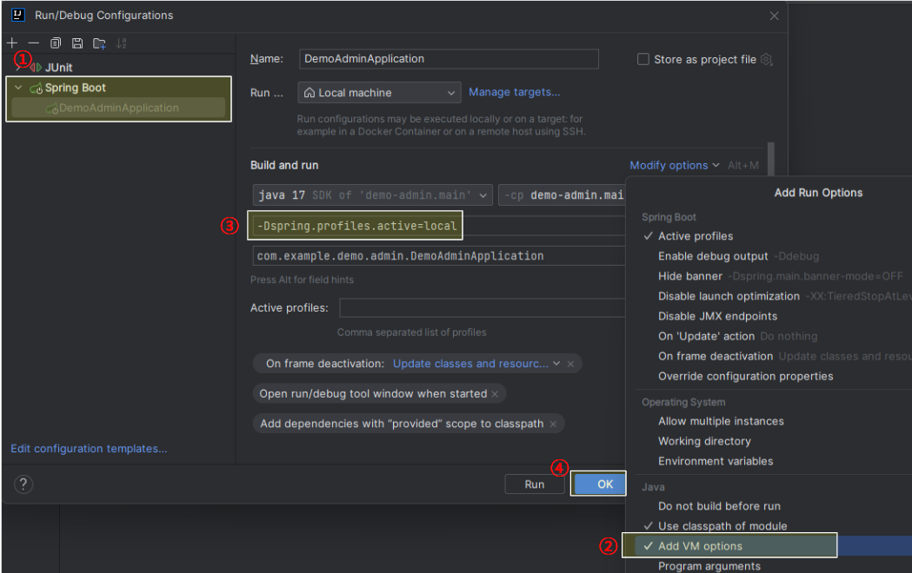
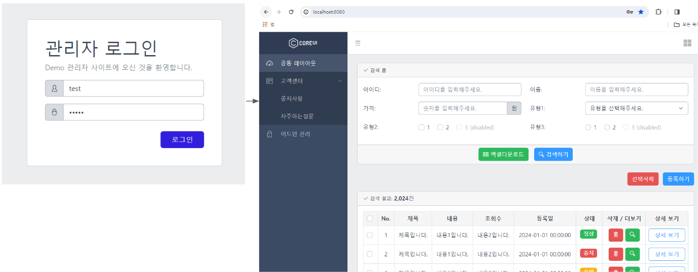

# `Execution Guide`

## 1) 프로그램 설치 및 사전 작업
- `IDE: IntelliJ IDEA`
- `Configuration Management Tool: Git`
- `DB: MySQL, Tool: MySQL Workbench`
  - `create database`
    - name: demo_schema
  - `create users and privileges`
    - username: demo_user
    - password: pwd2024!!
  - `database connection`
    - Connection Name: localhost-demo
    - Hostname: 127.0.0.1
    - Port: 3306
    - Username: demo_user
    - Password: pwd2024!!
  - `execute sql - DDL`
    - [수행 쿼리 정보](../sql/schema.sql)
  - 위 전체 과정 참고
    - 작성중

## 2) 애플리케이션 실행
1. `git clone https://github.com/tngh4037/demo-admin.git`
2. `[Edit Configurations...] - 자바 시스템 속성 설정 (프로필 지정)`

3. `Run DemoAdminApplication`
4. `http://localhost:8080 실행 (* 초기 관리자 계정: [아이디(test), 패스워드(test!)])`
